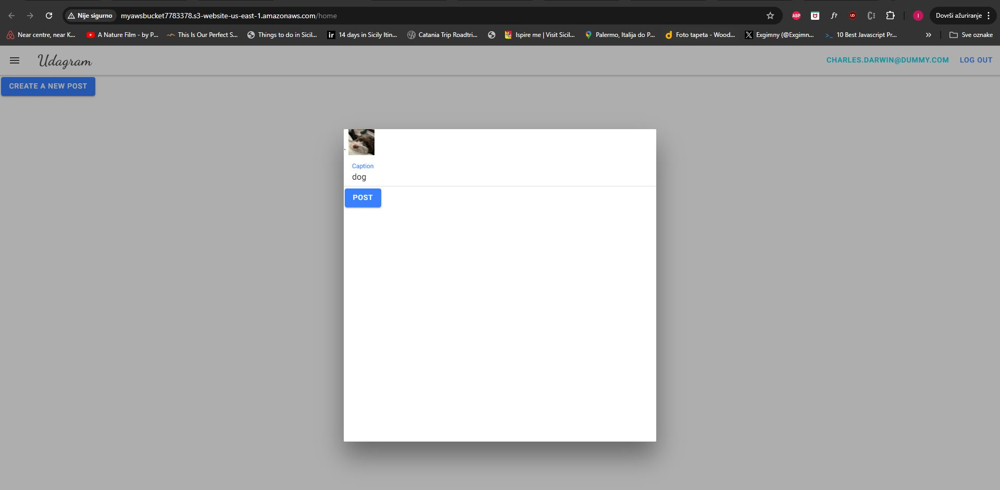

# Hosting a Full-Stack Application

This is a deployment project as part of the Udacity nanodegree program Full-stack Javascript development. The application is provided from Udacity to be hosted into AWS with Pipeline using CircleCI.
Check the working app at:  
 http://myawsbucket7783378.s3-website-us-east-1.amazonaws.com/home

# Udagram

This application is provided to you as an alternative starter project if you do not wish to host your own code done in the previous courses of this nanodegree. The udagram application is a fairly simple application that includes all the major components of a Full-Stack web application.



### Dependencies

```
- Node v14.15.1 (LTS) or more recent. While older versions can work it is advisable to keep node to latest LTS version

- npm 6.14.8 (LTS) or more recent, Yarn can work but was not tested for this project

- AWS CLI v2, v1 can work but was not tested for this project

- A RDS database running Postgres.

- A S3 bucket for hosting uploaded pictures.

```

### Installation

Provision the necessary AWS services needed for running the application:

1. In AWS, provision a publicly available RDS database running Postgres.
1. In AWS, provision a s3 bucket for hosting the uploaded files.
1. Export the ENV variables needed or use a package like [dotnev](https://www.npmjs.com/package/dotenv)/.
1. From the root of the repo, navigate udagram-api folder `cd udagram/udagram-api` to install the node_modules `npm install`. After installation is done start the api in with `npx tsc && npm run start`.
1. Without closing the terminal in step 1, navigate to the udagram-frontend `cd udagram/udagram-frontend` to intall the node_modules `npm install -f`. After installation is done start the api in dev mode with `ng serve`.

### Pipeline

CircleCI is following the repository on the github for any changes. Commit triggers CircleCI and the pipeline starts ahead with the workflow:

- Build the application:
  - Install NodeJS and NPM.
  - Install the Front-End dependencies.
  - Install the API dependencies.
  - Lint the Front-End code.
  - Build the Front-End application.
  - Build the API application.
- Hold and wait for approval before deployment.
- Deploy the application:
  - Install NodeJS and NPM.
  - Setting up Elastic Beanstalk.
  - Setting up AWS cli.
  - Deploy the API to Elastic Beanstalk.
  - Deploy the Front-End to AWS S3.

### Testing

This project contains two different test suite: unit tests and End-To-End tests(e2e). Follow these steps to run the tests.

1. `cd udagram/udagram-frontend`
1. `npm run test`
1. `npm run e2e`

There are no Unit test on the back-end

## Built With

- [Angular](https://angular.io/) - Single Page Application Framework
- [Node](https://nodejs.org) - Javascript Runtime
- [Express](https://expressjs.com/) - Javascript API Framework
