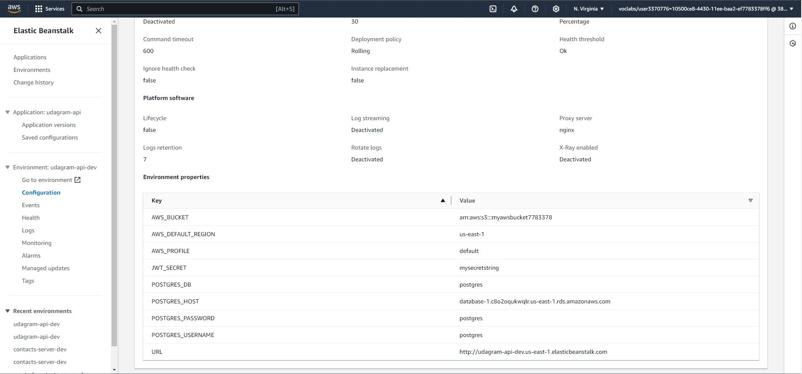

### Infrastructure

- AWS RDS for the Postgres database
- AWS ElasticBeanstalk for the API
- AWS s3 for web hosting

#

- AWS RDS for the Postgres database
  

- AWS ElasticBeanstalk for the API
  

- Environmental variables
  
  

- AWS s3 for web hosting
  
  

#

The app is accessible via the link provided:

http://myawsbucket7783378.s3-website-us-east-1.amazonaws.com/home
