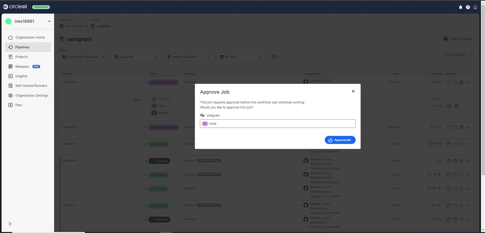
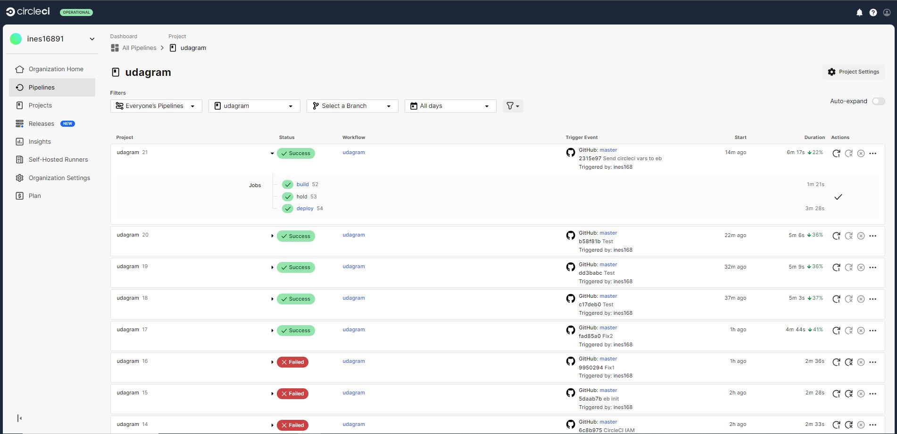
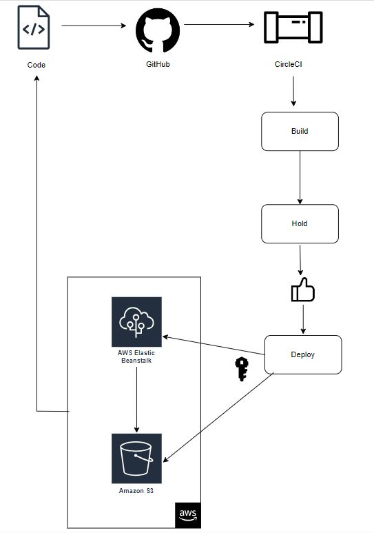

### Pipeline

CircleCI is following the repository on the github for any changes. Commit triggers CircleCI and the pipeline starts ahead with the workflow:

- Build the application:
  - Install NodeJS and NPM.
  - Install the Front-End dependencies.
  - Install the API dependencies.
  - Lint the Front-End code.
  - Build the Front-End application.
  - Build the API application.
- Hold and wait for approval before deployment.
  
- Deploy the application:

  - Install NodeJS and NPM.
  - Setting up Elastic Beanstalk.
  - Setting up AWS cli.
  - Set Elastic Beanstalk Variables
  - Deploy the API to Elastic Beanstalk.
  - Deploy the Front-End to AWS S3.

Last successful:

###

Pipeline diagram:

